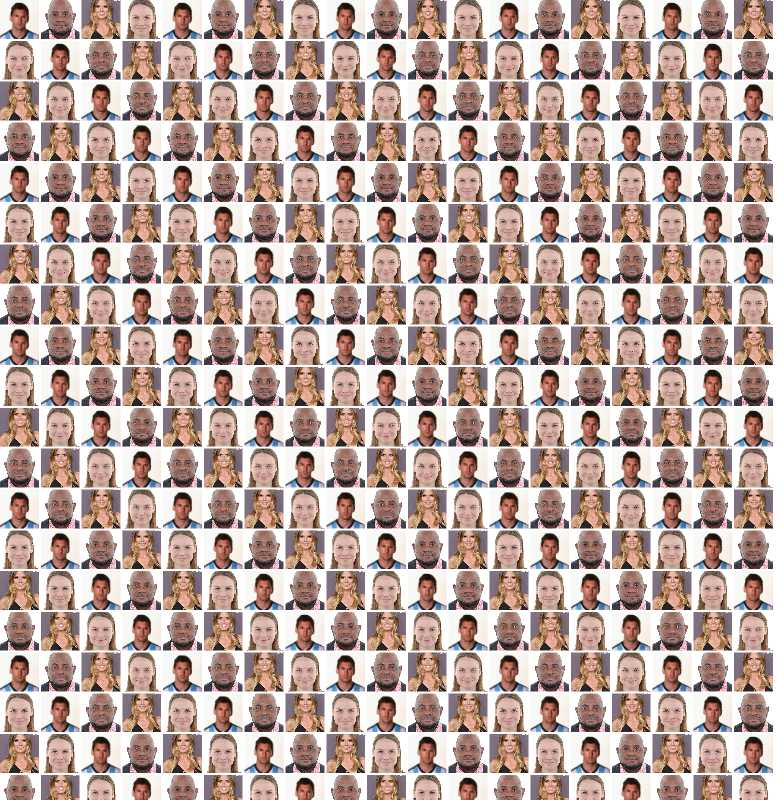

# Image Collage Generator

This is a Node.js application that generates an image collage from a set of images and optionally saves the collage as a JPEG file using Puppeteer.

## Pre-requisites

- Node.js installed on your machine
- Images you want to include in the collage

## Installation

1. Clone this repository to your local machine.
2. Navigate to the project directory.
3. Run `npm install` to install the dependencies.

## Configuration

The configuration options for the collage are located in `src/config.js`. You can modify the following options:

- `assetsFolderPath`: The path to the folder containing the images (default is './src/assets').
- `containerWidth`: The width of the collage container in pixels (default is 1200).
- `containerHeight`: The height of the collage container in pixels (default is 800).
- `columns`: The number of columns of pictures. The number of rows will be calculated accordingly to completely fill the output image with square tiles with the last row potentially being cut short (default is 24).
- `exportedFileQuality`: The quality of the exported file. This option only applies if the exported file is in JPEG format. It's a value between 0 and 100. The higher the value, the better the image quality and the larger the file size (default is 100).
- `gridGap`: The gap between images in the collage (default is '2px').
- `htmlFile`: The name of the HTML file to generate (default is 'collage.html').
- `jpegFile`: The name of the JPEG file to generate (default is 'collage.jpeg').
- `randomizePics`: Whether to randomize the order of the images (default is true).
- `saveCollageToFile`: Whether to save the collage as a JPEG file (default is true).

## Usage

To generate the collage, run the following command in the terminal:

```bash
npm run start
```

## Output

After running the script, you will find two output files in the project directory:

- `collage.html`: This is an HTML file that displays the image collage in your web browser. You can open this file directly in any web browser to view the collage.

- `collage.jpeg`: This is a JPEG file of the image collage. This file is only generated if `saveCollageToFile` is set to `true` in `config.js`. You can open this file in any image viewer to view the collage.



Please note that the output files will overwrite any existing files with the same names in the project directory.